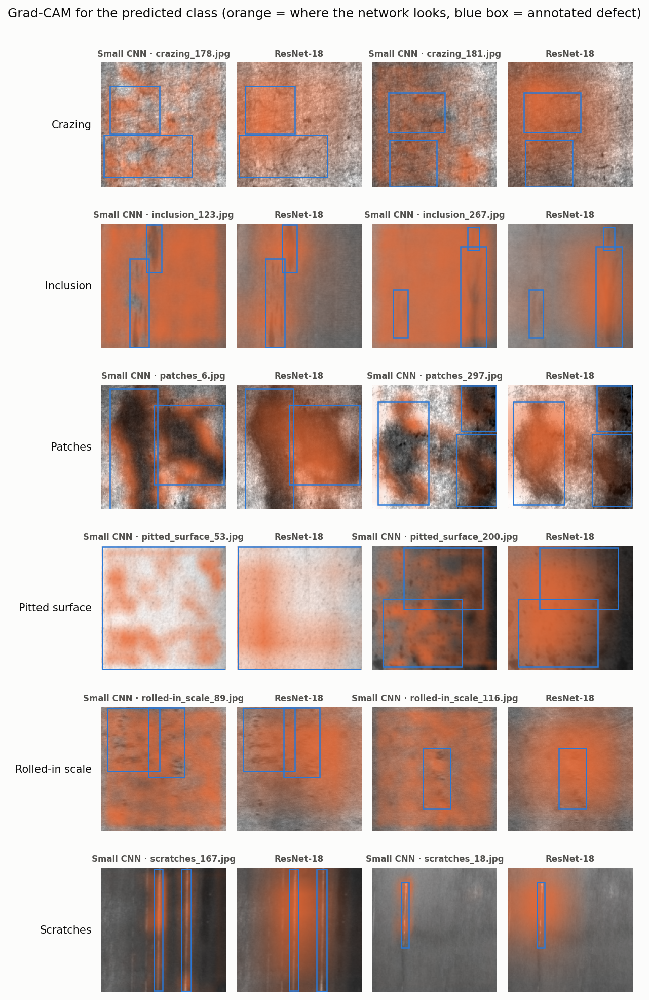
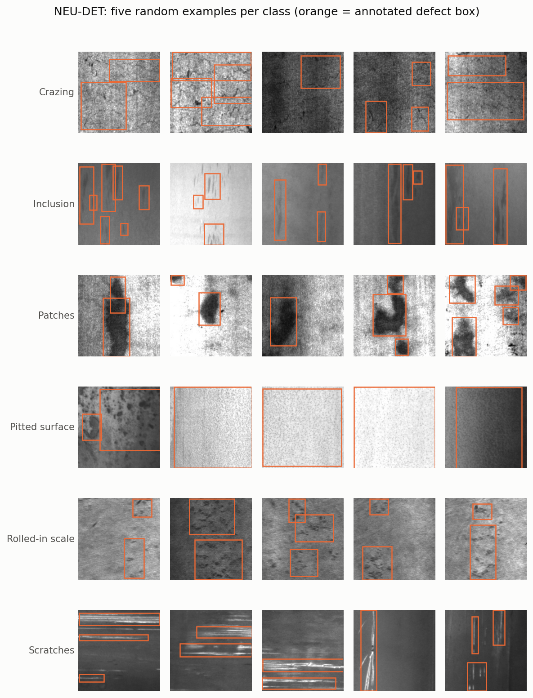
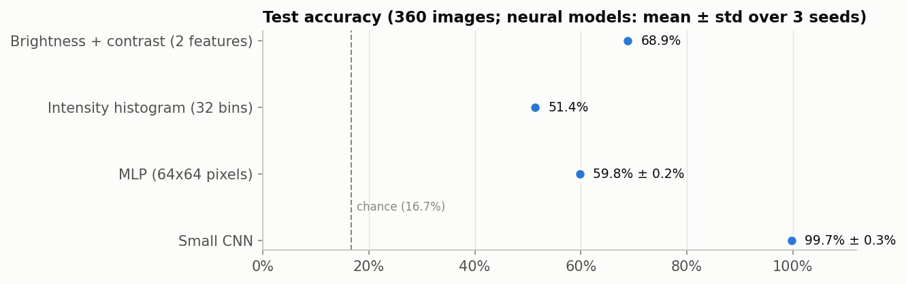
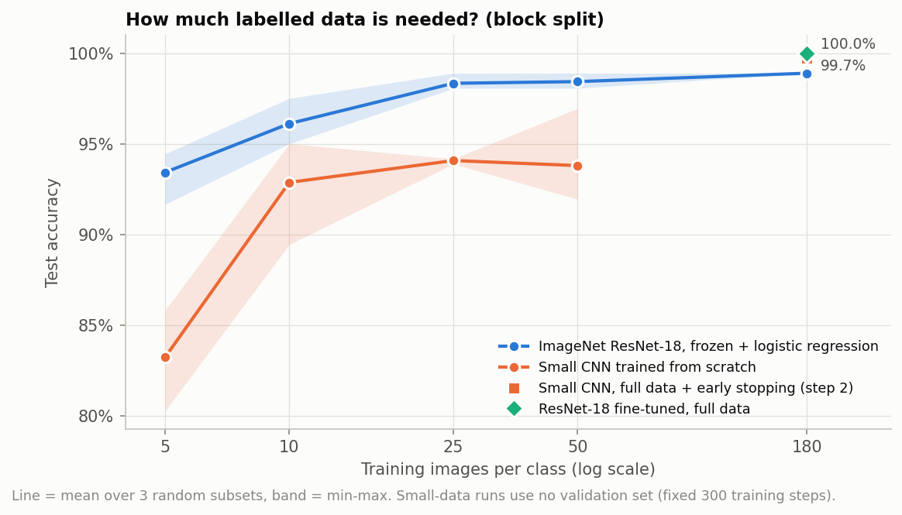
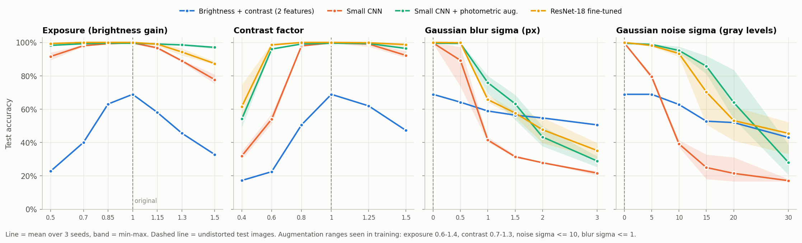
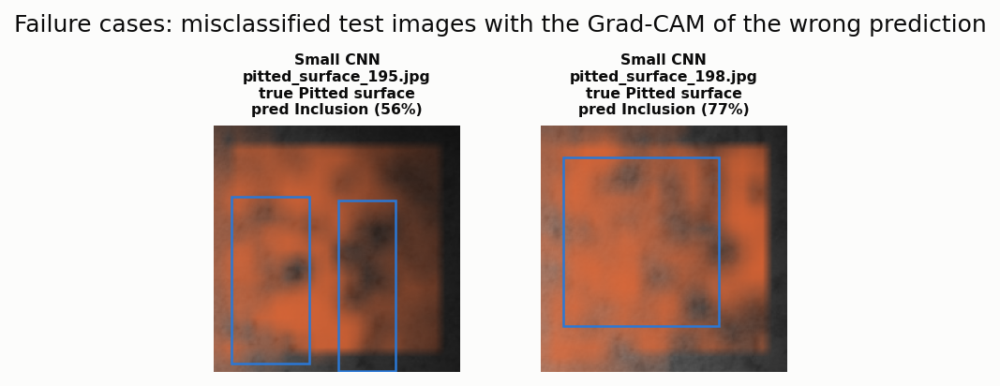
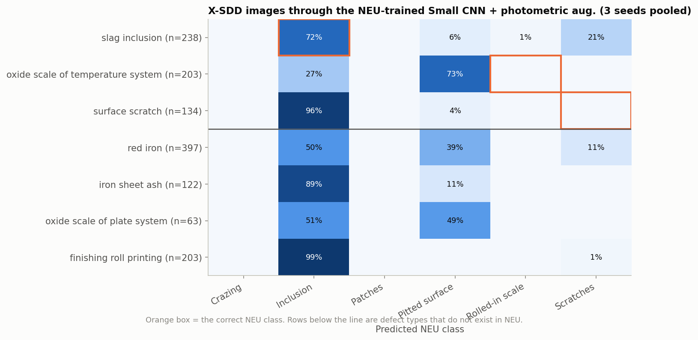
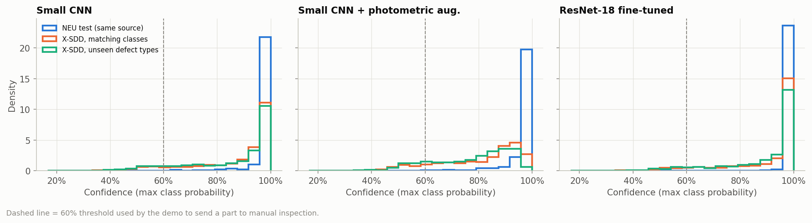
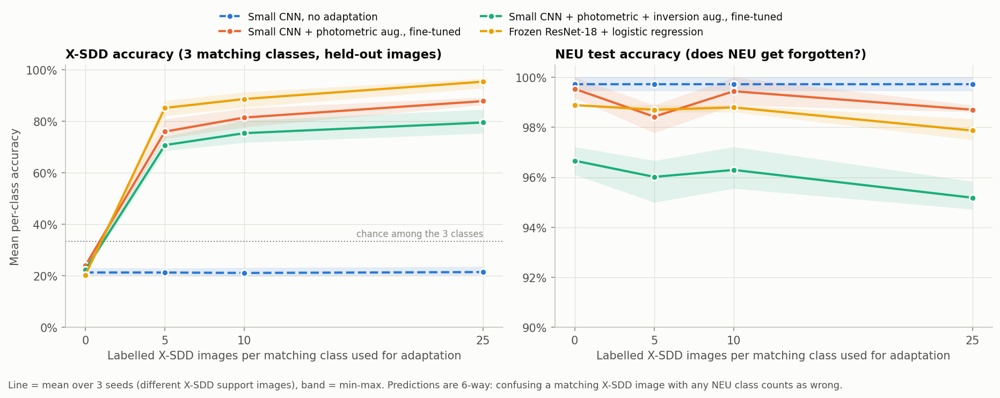

# Steel Surface Defect Classification — and Where It Breaks

COM4573 Artificial Neural Networks · Ankara University · Fall 2026

A convolutional network classifies six types of hot-rolled steel strip defects with
**99.7 % test accuracy**. This project goes further: it checks that the number is not
caused by data leakage, shows *why* a plain MLP fails, measures how little labelled data
is needed, stress-tests the models under realistic camera degradations, inspects what
the networks look at with Grad-CAM, and finally evaluates them on **an independent
dataset from another production line, where accuracy collapses to ~25 %**. The failure
analysis explains the collapse, and a few-shot adaptation experiment shows how to recover:
**five labelled images per class from the new line bring it back to 85 %**.



## Key findings

| # | Finding | Evidence |
|---|---|---|
| 1 | Global brightness and contrast alone (2 numbers per image) give **69 %** accuracy — the classes differ in lighting, which is a shortcut a model can exploit. | Step 2 |
| 2 | A 2.2 M-parameter **MLP barely beats that shortcut (60 %)**; a 98 k-parameter **CNN reaches 99.7 %**. Weight sharing and local receptive fields matter more than parameter count. | Step 2 |
| 3 | Consecutive NEU images are near-identical frames. A **block split** that keeps neighbours together was used as the main protocol; the CNN result held (98.8 % random split vs 99.7 % block split), so the in-dataset accuracy is not a leakage artefact. | Step 2b |
| 4 | **Frozen ImageNet features + logistic regression reach 93 % with only 5 images per class**, vs 83 % for a CNN trained from scratch. | Step 3 |
| 5 | The plain CNN breaks under small camera changes (noise σ=10: **39 %**). **Photometric augmentation** restores most of it (**95 %**). | Step 4 |
| 6 | The hottest Grad-CAM pixel lies inside an annotated defect box for **71 %** of test images (chance: 38 %). | Step 5 |
| 7 | On the independent **X-SDD** dataset the models score **23–30 %** on the three matching classes. Scratches fail because their polarity is inverted (bright on dark in NEU, dark on bright in X-SDD): **inverting those images lifts ResNet-18 from 7 % to 99.5 %** on scratches. | Step 6 |
| 8 | On defect types they have never seen, the models stay **78–90 % confident** on average; a 60 % confidence threshold flags only 7–16 % of them. **Softmax confidence is not a safe out-of-distribution detector.** | Step 6 |
| 9 | Training with random intensity inversion does **not** fix the transfer (22 % on X-SDD) and costs 3 points on NEU — polarity is not the only difference between the lines. | Step 7 |
| 10 | **Few-shot adaptation works:** with frozen ImageNet features, **5 labelled X-SDD images per class give 85 %, 25 give 95 %**, while NEU accuracy stays at ~98 %. | Step 7 |

## Data

**NEU surface defect database** (Song & Yan, 2013): 1 800 grayscale 200×200 images of hot-rolled
steel strip, 300 per class — crazing, inclusion, patches, pitted surface, rolled-in scale,
scratches — with defect bounding boxes. One exact duplicate pair (`patches_101`/`patches_105`)
was found and removed before splitting.



**X-SDD** (Feng et al., 2021): 1 360 images of seven hot-rolled strip defect types from a
different production line, used only for testing. Class correspondence:

| X-SDD | NEU |
|---|---|
| slag inclusion (238) | inclusion |
| oxide scale of temperature system (203) | rolled-in scale |
| surface scratch (134) | scratches |
| red iron, iron sheet ash, oxide scale of plate system, finishing roll printing (785) | — (unseen defect types) |

### Evaluation protocol

* **Block split (main):** within each class, images are grouped into blocks of 30 consecutive
  numbers; whole blocks go to train / validation / test (6 / 2 / 2 blocks → 180 / 60 / 60 images
  per class). Feature similarity stays elevated for neighbours up to ~10 numbers apart, so a
  random split would place near-copies on both sides.
* **Random split:** stratified 60 / 20 / 20, kept for comparison (`results/random/`).
* Validation set: early stopping and model choice only. The test set is evaluated once.
* Neural models: 3 seeds, reported as mean ± std.

## Results (block split, 360 test images)

### Step 2 — baselines

| Model | Parameters | Test accuracy | Macro F1 |
|---|---|---|---|
| Brightness + contrast → logistic regression | 2 features | 68.9 % | 0.69 |
| Intensity histogram → logistic regression | 32 features | 51.4 % | 0.51 |
| MLP on 64×64 pixels | 2.16 M | 59.8 ± 0.2 % | 0.58 |
| **Small CNN** (4 conv blocks + GAP) | **98 k** | **99.7 ± 0.3 %** | **1.00** |



### Step 3 — transfer learning and small data

| Images per class | Frozen ResNet-18 + logistic regression | Small CNN from scratch |
|---|---|---|
| 5 | 93.4 ± 1.5 % | 83.2 ± 2.8 % |
| 10 | 96.1 ± 1.3 % | 92.9 ± 3.0 % |
| 25 | 98.3 ± 0.5 % | 94.1 ± 0.2 % |
| 50 | 98.4 ± 0.4 % | 93.8 ± 2.7 % |
| 180 (all) | 98.9 % | 99.7 ± 0.3 % (with early stopping) |

Fine-tuning the whole ResNet-18 on all data: **100.0 ± 0.0 %**.
Small-data runs never use the validation set (fixed budget of 300 gradient steps).



### Step 4 — robustness to camera degradations

| Model | Exposure ×0.5 | Exposure ×1.5 | Contrast ×0.4 | Blur σ=1 | Noise σ=10 | Noise σ=20 |
|---|---|---|---|---|---|---|
| Brightness + contrast | 22.8 % | 32.8 % | 17.2 % | 58.9 % | 62.8 % | 51.9 % |
| Small CNN | 91.6 % | 77.7 % | 31.9 % | 41.5 % | 39.2 % | 21.5 % |
| Small CNN + photometric aug. | **98.2 %** | **97.0 %** | 54.2 % | **75.9 %** | **95.2 %** | **64.0 %** |
| ResNet-18 fine-tuned | 99.4 % | 87.3 % | **61.6 %** | 65.7 % | 93.3 % | 53.1 % |

Augmentation during training: exposure 0.6–1.4, contrast 0.7–1.3, noise σ ≤ 10, blur σ ≤ 1 —
so exposure ×1.5, contrast ×0.4 and noise σ=20 are outside what the augmented model has seen.



### Step 5 — what the networks look at

Pointing game: a Grad-CAM map "hits" when its hottest pixel falls inside an annotated defect
box; chance is the box-covered share of the image.

| Model | Hit rate | Chance |
|---|---|---|
| Small CNN | 71.1 % | 37.9 % |
| ResNet-18 fine-tuned | 71.1 % | 37.9 % |

Per class, the Small CNN localises scratches (95 %) and patches (90 %) well but **inclusion
poorly (13 %, below chance)**: it recognises inclusion from the plain background around the
defect. Two of the three CNN errors (three seeds pooled) are predictions of *inclusion*, which
acts as the "smooth surface" fallback class — a pattern that reappears on X-SDD.



### Step 6 — an unseen dataset (X-SDD)

| Model | 3 matching classes | inclusion | rolled-in scale | scratches | scratches, inverted |
|---|---|---|---|---|---|
| Small CNN | 26.5 % | 64.0 % | 0.0 % | 0.0 % | 38.1 % |
| Small CNN + photometric aug. | 29.8 % | 72.0 % | 0.0 % | 0.0 % | 61.2 % |
| ResNet-18 fine-tuned | 22.5 % | 50.7 % | 0.0 % | 6.5 % | **99.5 %** |

* X-SDD *oxide scale* (dark specks on bright steel) is mostly predicted as NEU *pitted
  surface* (73 % for the best model) — which looks exactly like that in NEU.
* Unseen defect types are mostly labelled *inclusion*, with high confidence.
* Re-normalising with X-SDD pixel statistics does not help (2–7 %).




### Step 7 — closing the gap

Two remedies were tried. **(A)** Train the Small CNN with photometric augmentation plus random
intensity inversion, so that bright-on-dark and dark-on-bright defects look alike. **(B)** Few-shot
adaptation: add *k* labelled X-SDD images per matching class to the NEU training data (oversampled
to ~20 % of each epoch), fine-tune for 6 epochs, and test on the remaining X-SDD images. Three
different random draws of the support images; support images are never tested on.

Mean per-class accuracy on the three matching X-SDD classes (held-out images) and NEU test accuracy:

| Method | k = 0 | k = 5 | k = 10 | k = 25 | NEU at k = 25 |
|---|---|---|---|---|---|
| Small CNN, NEU only | 21.3 % | — | — | — | 99.7 % |
| (A) Small CNN + photometric + inversion aug. | 22.4 % | — | — | — | 96.7 % (k = 0) |
| (B) fine-tuned Small CNN + photometric + inversion aug. | 22.4 % | 70.8 % | 75.4 % | 79.6 % | 95.2 % |
| (B) fine-tuned Small CNN + photometric aug. | 24.0 % | 76.0 % | 81.5 % | 87.9 % | 98.7 % |
| (B) frozen ImageNet ResNet-18 + logistic regression | 20.3 % | **85.2 %** | **88.7 %** | **95.4 %** | 97.9 % |

* **Inversion augmentation alone does not transfer.** Inverting X-SDD scratches at *test* time
  works for ResNet-18 (Step 6), but teaching the small CNN that both polarities are scratches
  still leaves X-SDD scratches at 4 %: line width, resolution (128 px upsampled) and background
  texture also differ. It also costs ~3 points on NEU.
* **A handful of target-domain labels is far more effective than any augmentation tried.**
  X-SDD rolled-in scale goes from 0 % to 98.5 % with five images per class (linear probe).
  Inclusion remains the hardest class (58–88 % across methods).
* Generic ImageNet features adapt best: with few labels, a linear classifier on frozen
  features beats fine-tuning a small network trained from scratch.



## Limitations

* NEU test performance is near ceiling, so differences between strong models on NEU
  (99.7 % vs 100 %) are within one or two images. Only two blocks per class form the test
  set; the random-vs-block gap (≈1 point) indicates the uncertainty from the split itself.
* The X-SDD class mapping is approximate (different annotation conventions, resolutions:
  128×128 upsampled to 200×200).
* Robustness degradations are synthetic and applied independently; real cameras combine them.
* Grad-CAM shows correlation with the decision, not causation; the pointing game depends on
  how generously boxes were drawn (pitted surface boxes cover 83 % of the image).
* A 6-way classifier always outputs one of six classes. Deployment would need an explicit
  "unknown defect" mechanism; softmax confidence alone is not enough (Step 6).
* Few-shot adaptation was evaluated on three X-SDD classes only; the support images come from
  the same X-SDD pool as the query images, which is optimistic compared with labelling the
  first parts of a new production run.

## Running it

```bash
pip install -r requirements.txt
python run_all.py          # block split, all steps (~2 h on a 12-core CPU, no GPU needed)
python run_all.py random   # random split, steps 1-3, for the comparison
streamlit run app.py       # interactive demo
```

Data: put NEU-DET in `NEU-DET/` (`IMAGES/`, `ANNOTATIONS/`) and X-SDD in `external/X-SDD/`
(one folder per class, from the X-SDD GitHub repository). Each training run writes per-epoch
progress with a time estimate to `results/<split>/logs/`.

### Demo

`app.py` (Streamlit) classifies a test-set or uploaded image, shows class probabilities and
the Grad-CAM overlay, and lets you degrade the image with exposure / contrast / blur / noise
sliders to watch the prediction change. Predictions below 60 % confidence are flagged for
manual inspection.

## Project structure

```
defect/            data loading & splits, models, training loop, Grad-CAM, plotting style
01_explore.py      dataset inspection, duplicate check, split creation
02_baselines.py    intensity baselines, MLP, Small CNN (3 seeds)    02_plots.py
02b_leakage_check.py  near-duplicate analysis between train and test
03_transfer.py     ResNet-18 linear probe & fine-tuning, small-data runs    03_plots.py
04_robustness.py   photometric augmentation + degradation tests
05_gradcam.py      Grad-CAM, pointing game, failure cases
06_cross_dataset.py  X-SDD evaluation, confidence analysis
07_domain_shift.py inversion augmentation, few-shot adaptation to X-SDD
app.py             Streamlit demo
results/<split>/   CSV results, logs        figures/<split>/   all figures
```

## References

* K. Song, Y. Yan. *A noise robust method based on completed local binary patterns for
  hot-rolled steel strip surface defects.* Applied Surface Science, 2013. (NEU dataset)
* Y. He, K. Song, Q. Meng, Y. Yan. *An end-to-end steel surface defect detection approach via
  fusing multiple hierarchical features.* IEEE TIM, 2020. (NEU-DET annotations)
* X. Feng, X. Gao, L. Luo. *X-SDD: A New Benchmark for Hot Rolled Steel Strip Surface Defects
  Detection.* Symmetry 13(4), 706, 2021.
* R. R. Selvaraju et al. *Grad-CAM: Visual Explanations from Deep Networks via Gradient-based
  Localization.* ICCV 2017.
* K. He et al. *Deep Residual Learning for Image Recognition.* CVPR 2016.
* C. C. Aggarwal. *Neural Networks and Deep Learning: A Textbook*, 2nd ed. Springer, 2023.
